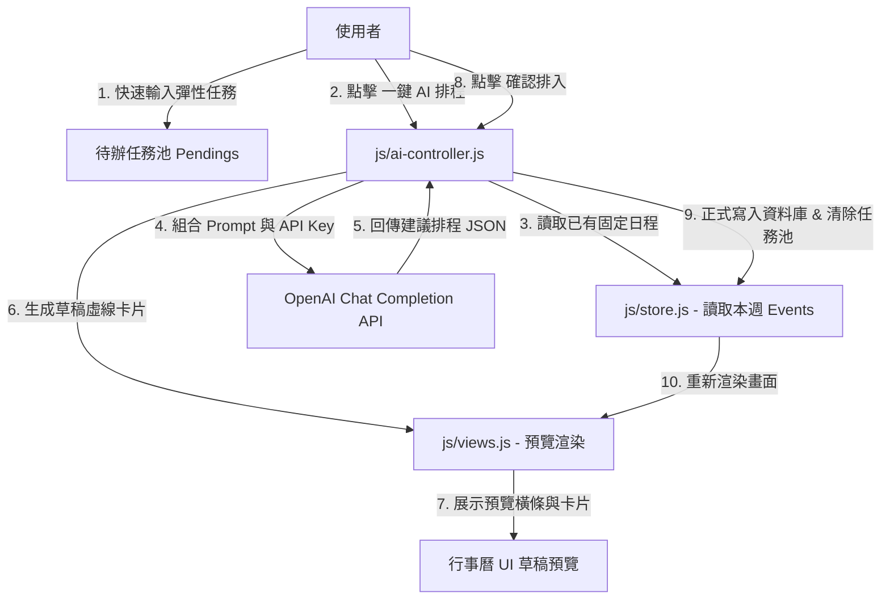

# 🤖 「擊敗拖延症！」AI 智慧排程系統架構設計說明書 (AI Procrastination-Killer Scheduler Architecture)

本文件詳細闡述了專為**拖延症患者**設計的「AI 智慧排程行事曆」核心功能之軟體架構、資料流程、OpenAI GPT API 提示工程 (Prompt Engineering) 與 UI/UX 互動規格。

---

## 1. 核心產品概念 (Product Concept)

### 拖延症患者的痛點
1. **規劃癱瘓 (Planning Paralysis)**：面對非固定時間的任務（如「這週要讀書4小時」、「運動3次」），因為不知道該塞在哪些時段，光是「排日程」這件事就消耗了所有意志力，最終選擇逃避。
2. **決策疲勞 (Decision Fatigue)**：每天都要決定「現在該做什麼」，容易在瑣事中分心，將重要但不緊急的事情無限延後。

### AI 解決方案
* **「隨手記」任務池 (Inbox Task Pool)**：使用者只需快速輸入任務名稱、預計花費時數及時段偏好，無需決定具體日期和時間。
* **「一鍵打敗拖延」AI 智慧排程**：
  1. 系統自動收集**當前一星期內的「固定/已有日程」**（作為 busy slots）。
  2. 系統收集**「待辦任務池」中的彈性任務**。
  3. 將資料送給 GPT API，由 AI 依據**大腦精力分配規律**（例如：早上專注力高排讀書、下午排運動、任務之間留緩衝、避開深夜等），在空閒時段自動精準 block 出時間。
  4. 行事曆以**「虛線草稿預覽」**呈現排程結果，使用者一鍵確認後正式排入，杜絕拖延！

---

## 2. 系統資料流與運作流程 (System Data Flow)



---

## 3. 資料模型設計 (Data Model Design)

### 3.1 待辦彈性任務模型 (Pending Task Model)
存於 `Store.state.pendingTasks` 中，以 `localStorage` 持久化。

```typescript
interface PendingTask {
  id: string;              // 唯一識別碼 (pending-前綴)
  title: string;           // 任務名稱 (如 "研讀 AI 論文")
  duration: number;        // 預計花費時數 (單位：小時，支援小數，如 1.5, 2)
  timePreference: 'morning' | 'afternoon' | 'evening' | 'any'; // 偏好時段
  color: string;           // 分類色彩標籤
  description?: string;    // 備註描述 (選填)
}
```

### 3.2 草稿預覽狀態 (AI Preview State)
在 `Store.state` 中新增以下暫存狀態：

```typescript
interface AIPreviewState {
  isProposed: boolean;     // 當前是否處於 AI 建議預覽狀態
  proposedEvents: CalendarEvent[]; // GPT 產生的草稿行程陣列 (帶有 unique ID 但尚未存入正式 Events)
}
```

---

## 4. OpenAI API 提示工程 (Prompt Engineering)

本系統將調用 OpenAI `gpt-4o` 或 `gpt-3.5-turbo` 介面，並開啟 **JSON Mode (`response_format: { type: "json_object" }`)** 確保回傳資料格式絕對正確。

### 4.1 系統提示詞 (System Prompt)
```text
你是一位專門幫助「重度拖延症患者」克服規劃癱瘓的時間管理教練。
你的目標是幫使用者將「非固定時間的彈性任務」合理、精準地安插到「本週的空閒時段」中，強迫他們 block 時間專注執行。

請遵循以下排程心理學原則：
1. 認知負荷分配：高專注力任務（如讀書、寫程式、寫報告）優先安排在早晨至中午（09:00 - 12:00）；體能/動態任務（如運動、清潔）安排在下午（14:00 - 18:00）；輕量/社交任務安排在傍晚或晚上。
2. 留白與緩衝：任何排程任務前後必須與「已有行程」至少保留 15-30 分鐘的緩衝時間。
3. 避免過載：每天安排的 AI 彈性任務總時數不得超過 5 小時，單次任務不連續超過 2.5 小時，防止大腦疲勞導致再次拖延。
4. 時間合理性：絕對不要在深夜（22:00 - 08:00）或用餐時間（12:00-13:30, 18:00-19:30）排入任何工作任務。

你必須回傳一個嚴格的 JSON 物件，格式如下：
{
  "scheduledEvents": [
    {
      "title": "🤖 [任務名稱]",
      "startDate": "YYYY-MM-DDTHH:mm",
      "endDate": "YYYY-MM-DDTHH:mm",
      "color": "[傳入的顏色]",
      "description": "AI 抗拖延建議：[請寫一句溫暖、具鼓勵性且解釋為何安排在此時段的簡短說明，字數 30 字內]"
    }
  ]
}
```

### 4.2 使用者資料 Prompt (User Prompt)
將目前系統狀態轉譯為 GPT 能解讀的上下文：
```json
{
  "currentDate": "2026-05-23 (星期六)",
  "weekRange": "2026-05-24T00:00 至 2026-05-30T23:59",
  "occupiedSlots": [
    { "start": "2026-05-25T10:00", "end": "2026-05-25T12:00", "title": "🤖 系統架構設計評審會" }
  ],
  "pendingTasks": [
    { "id": "pending-1", "title": "閱讀認知科學書籍", "duration": 2.0, "timePreference": "morning", "color": "blue" },
    { "id": "pending-2", "title": "健身房有氧跑步", "duration": 1.0, "timePreference": "afternoon", "color": "emerald" }
  ]
}
```

---

## 5. UI/UX 互動元件設計 (UI/UX Components)

為營造極具未來感的 AI 體驗，我們在網頁版上設計了以下互動細節：

### 5.1 側邊欄「待辦任務池」(Pending Tasks Widget)
位於側邊欄下方，採用折疊面板設計。
1. **快速新增欄位**：一個簡潔的 Input 框與時數 Selector，如 `[ 研讀英文文法 ]` `[ 1.5 小時 ]` `[ 偏好: 早上 ]` `[ + 新增 ]`。
2. **任務卡片列表**：顯示所有待安排任務，滑鼠懸停時顯示細微的紅色刪除按鈕。
3. **AI 啟動按鈕**：底部放置一個極具奢華感、帶有漸變流光動畫的按鈕：**「🤖 一鍵擊敗拖延！AI 智慧排程」**。

### 5.2 API Key 安全設定 Modal
由於使用者提供自己的 API Key，我們必須保障隱私安全：
* 點擊側邊欄右上角的「⚙️ 設定」齒輪按鈕，開啟毛玻璃彈窗。
* 輸入 `OpenAI API Key`，儲存於本地 `localStorage`，絕不上傳伺服器。支援自訂 API 代理網址 (API Base URL) 以防網路限制。

### 5.3 載入動畫 (Motivational Loading Overlay)
當 AI 正在排程時，行事曆主區會覆蓋一層半透明的毛玻璃載入遮罩，並以流暢淡入淡出的方式展示「抗拖延心理學小金句」，如：
* *“拖延的本質是焦慮，AI 正在為您建立無痛的起步時段...”*
* *“大腦在早晨的決策意志力最強，已為您將高難度任務排在上午...”*
* *“運動能產生多巴胺，已為您安排在下午的疲憊期...”*

### 5.4 草稿預覽與操作列 (Draft Preview Action Bar)
當 API 回傳資料後，遮罩消失，行事曆呈現以下效果：
1. **草稿日程卡片**：所有 AI 建議的行程以 **「虛線外框、半透明背景、帶有 🤖 圖示」** 的特製樣式渲染在日曆網格上，與正式行程做明顯區隔。
2. **頂部操作橫條 (Action Bar)**：主畫面頂部滑入一個磨砂玻璃橫條：
   > **🤖 AI 已為您規劃好本週最佳防拖延時程！**
   > [ 確定排入行事曆 ] [ 取消重新規劃 ]
   * **確定排入**：草稿行程轉為正式行程（存入 localStorage），清空待辦任務池，並伴隨粒子灑落（Confetti）慶祝動畫！
   * **取消**：清除草稿，恢復原狀。

---

## 6. 核心程式碼實作指引

本功能預計新增與修改以下檔案：

1. **[NEW] [js/ai-controller.js](file:///Users/wuyulai/Documents/Time_schedule/js/ai-controller.js)**:
   * 負責 OpenAI API 的 `fetch` 串接。
   * 將現有行程與待辦任務打包成 Prompt 參數。
   * 處理 Draft 預覽狀態的確認與取消邏輯。
2. **[MODIFY] [index.html](file:///Users/wuyulai/Documents/Time_schedule/index.html)**:
   * 在側邊欄新增「隨手記任務池」UI 結構與新增欄位。
   * 新增 API Key 設定 Modal 結構。
   * 新增頂部 AI 操作橫條。
3. **[MODIFY] [css/main.css](file:///Users/wuyulai/Documents/Time_schedule/css/main.css)**:
   * 新增任務池卡片、流光按鈕、虛線草稿行程卡片（`.event-card.ai-preview`）與頂部操作列的動畫樣式。
4. **[MODIFY] [js/store.js](file:///Users/wuyulai/Documents/Time_schedule/js/store.js)**:
   * 新增 `pendingTasks` 與 `aiPreview` 相關狀態與增刪改查方法。
5. **[MODIFY] [js/views.js](file:///Users/wuyulai/Documents/Time_schedule/js/views.js)**:
   * 在月、週、日視圖渲染中，加入支援 `ai-preview` 虛線草稿卡片的渲染邏輯。
6. **[MODIFY] [js/app.js](file:///Users/wuyulai/Documents/Time_schedule/js/app.js)**:
   * 綁定任務池的新增/刪除事件、⚙️ 設定 Modal 點擊事件、AI 按鈕點擊事件及操作橫條按鈕事件。

本架構說明書為您的核心 AI 功能奠定了無懈可擊的產品基礎！這款行事曆將不只是一個記錄工具，而是一個真正具備情緒調節與心理學基礎的**「抗拖延時間教練」**。
