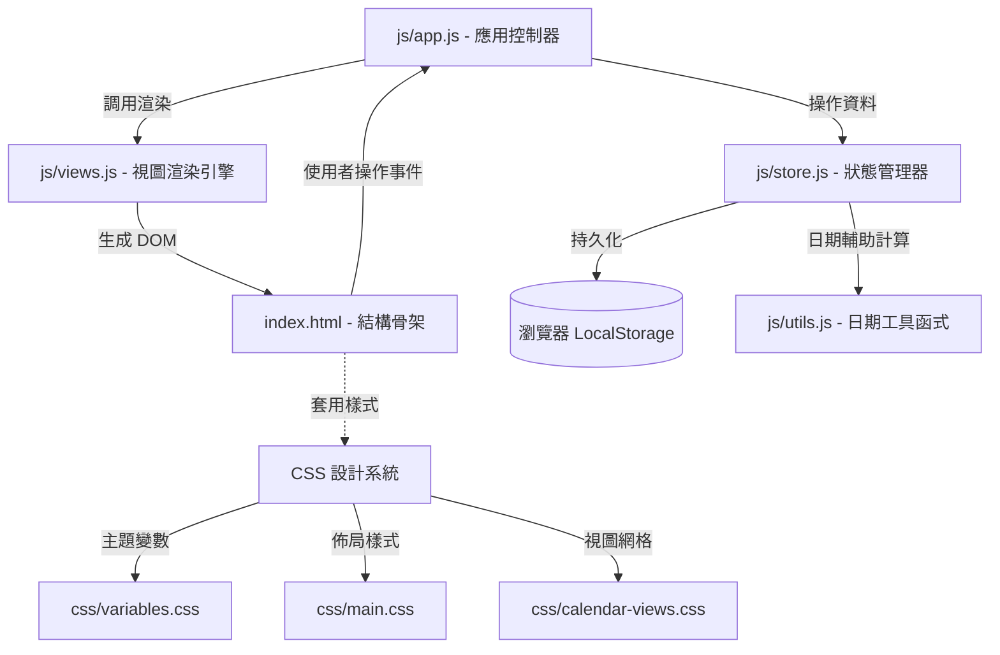
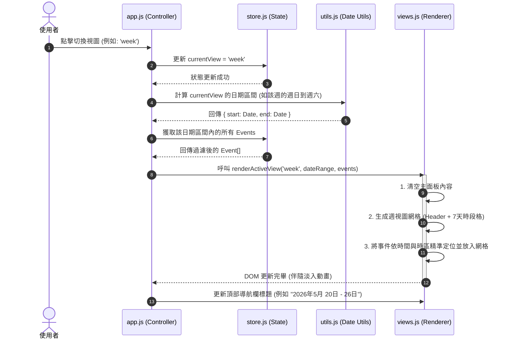

# 📅 行事曆系統架構設計說明書 (Calendar System Architecture)

本文件詳細闡述了具備**月 (Month)**、**週 (Week)**、**日 (Day)** 三種視圖切換功能的現代化網頁行事曆應用程式（Single Page Application, SPA）之軟體架構、資料流與設計規格。

---

## 1. 系統整體架構 (System Architecture Overview)

本系統採用經典的 **MVC (Model-View-Controller)** 架構模式，並透過原生 **ES6+ JavaScript** 模組化實作，無需依賴 React、Vue 等重量級前端框架，確保極致的效能、秒開速度與流暢的微動畫。



### 目錄與檔案結構說明

```text
Time_schedule/
├── index.html                  # 應用程式的主入口點 (包含 DOM 骨架結構)
├── architecture.md             # 本系統架構設計說明書
├── css/
│   ├── variables.css           # 全局 CSS 變數 (色彩系統、毛玻璃效果、字型、過渡動畫)
│   ├── main.css                # 基礎排版、頂部導航、側邊欄及通用 UI 元件樣式
│   ├── calendar-views.css      # 月、週、日三種視圖的 CSS Grid / Flexbox 響應式佈局
│   └── components.css          # 事件彈窗 (Modal)、表單、按鈕、通知元件樣式
└── js/
    ├── app.js                  # 核心控制器：初始化應用、事件監聽與協調
    ├── store.js                # 狀態管理器：事件 CRUD 邏輯、LocalStorage 同步、過濾狀態
    ├── utils.js                # 日期輔助工具：日期格式化、跨度計算、月/週/日曆網格數據計算
    ├── views.js                # 視圖渲染器：月、週、日三個視圖的動態 DOM 生成與局部更新
    └── components/
        └── modal.js            # 事件新增/編輯/詳情彈窗元件
```

---

## 2. 資料模型設計 (Data Model Design)

### 2.1 行事曆事件物件 (Calendar Event)
每個行程/事件在系統中以下列 JSON 結構表示：

```typescript
interface CalendarEvent {
  id: string;             // 唯一識別碼 (使用 UUID v4 格式生成)
  title: string;          // 事件標題 (例如: "專案架構評審會議")
  description?: string;   // 事件詳細描述 (選填)
  startDate: string;      // 開始日期與時間 (ISO 格式: YYYY-MM-DDTHH:mm)
  endDate: string;        // 結束日期與時間 (ISO 格式: YYYY-MM-DDTHH:mm)
  color: string;          // 事件分類色彩標籤，對應 CSS 變數 (如 'blue', 'purple', 'emerald', 'amber', 'rose')
  isAllDay: boolean;      // 是否為全天事件 (全天事件將顯示在視圖最頂部的特殊區域)
  location?: string;      // 地點 (選填)
}
```

### 2.2 全局應用狀態 (Global Application State)
行事曆運作時的記憶體狀態 (State) 結構：

```typescript
interface ApplicationState {
  currentDate: Date;      // 使用者當前聚焦/瀏覽的日期基準點
  currentView: 'month' | 'week' | 'day';  // 當前啟用的視圖模式
  events: CalendarEvent[]; // 從 LocalStorage 載入的所有事件陣列
  filters: {
    selectedColors: string[]; // 用於過濾特定顏色分類的事件
    searchQuery: string;      // 關鍵字搜尋過濾
  };
  selectedEvent: CalendarEvent | null; // 當前正在編輯或查看詳情的事件對象
}
```

---

## 3. 核心功能模組與控制流程 (Core Modules & Flow)

### 3.1 視圖切換與導航流程 (View Switching & Navigation)
當使用者點擊「月」、「週」、「日」切換按鈕，或進行「上一頁」、「下一頁」、「回到今天」操作時，系統的反應流程如下：



### 3.2 視圖佈局演算法 (Layout Algorithms)

#### A. 月視圖 (Month View) - 6x7 固定網格
月視圖包含當前月的所有日子，並適當填充上個月的尾部與下個月的頭部，確保佈局固定為 6 列 7 行（共 42 格）：
1. 取得當前月份的第一天是星期幾 ($firstDayIndex \in [0, 6]$，0 代表星期日)。
2. 取得上個月的最後一天日期，用以填充前置格子。
3. 取得當前月份的總天數。
4. 使用 `utils.js` 生成一個包含 42 個日期物件的陣列，每個物件標註 `isCurrentMonth`、`isToday`。
5. 事件渲染：將事件按日期歸類，全天與跨日事件優先排列在格子的頂部。

#### B. 週視圖 (Week View) - 7欄 + 時間軸網格
週視圖採用 CSS Grid 佈局：
* **X 軸**：左側固定寬度時間軸 (00:00 - 23:00)，右側 7 等分表示週日至週六。
* **Y 軸**：24 小時時段（每格 60px 高度，可切換至每 30 分鐘微網格）。
* **事件定位演算法**：
  $$\text{Top Offset (px)} = (\text{開始小時} + \frac{\text{開始分鐘}}{60}) \times \text{時段高度 (60px)}$$
  $$\text{Height (px)} = \frac{\text{持續分鐘}}{60} \times \text{時段高度 (60px)}$$
  * **重疊事件處理**：若同一時段內有多個事件重疊，系統會計算重疊事件的總數，動態分配其 `width` (例如 2 個重疊則寬度各為 50%) 及 `left` 偏移，以防遮擋。

#### C. 日視圖 (Day View) - 單欄時間軸
與週視圖演算法類似，但右側僅有一欄，能提供最寬敞的空間展示單日內的詳細行程及重疊行程，並顯示「當前時間紅色指針線」。

---

## 4. UI/UX 與設計系統規格 (UI/UX & Design System)

為打造極具奢華感與 premium 體驗的 UI，我們設計了以下視覺系統：

### 4.1 色彩調色盤 (Theme & HSL Colors)
我們摒棄刺眼的飽和色，採用質感和諧的 HSL 微飽和色系，支援深色模式 (Dark Mode) 與毛玻璃效果。

| 顏色變數 | 說明 | 淺色模式值 (Light) | 深色模式值 (Dark) |
| :--- | :--- | :--- | :--- |
| `--bg-app` | 應用背景 | `hsl(220, 20%, 97%)` | `hsl(222, 25%, 10%)` |
| `--bg-panel` | 毛玻璃面板背景 | `hsla(0, 0%, 100%, 0.7)` | `hsla(222, 20%, 15%, 0.6)` |
| `--text-primary` | 主要文字 | `hsl(222, 47%, 11%)` | `hsl(210, 40%, 98%)` |
| `--text-secondary`| 次要文字 | `hsl(215, 16%, 47%)` | `hsl(215, 20%, 65%)` |
| `--border-color` | 網格/邊框 | `rgba(0, 0, 0, 0.08)` | `rgba(255, 255, 255, 0.08)` |
| `--accent-blue` | 預設行程藍 | `hsl(217, 91%, 60%)` | `hsl(217, 91%, 65%)` |
| `--accent-emerald`| 工作行程綠 | `hsl(142, 70%, 45%)` | `hsl(142, 70%, 50%)` |
| `--accent-rose` | 緊急行程紅 | `hsl(346, 84%, 61%)` | `hsl(346, 84%, 65%)` |

### 4.2 毛玻璃設計 (Glassmorphism Glass Effect)
主要面板與事件彈窗套用毛玻璃效果，營造漂浮與通透感：
```css
.glass-panel {
  background: var(--bg-panel);
  backdrop-filter: blur(16px) saturate(120%);
  -webkit-backdrop-filter: blur(16px) saturate(120%);
  border: 1px solid var(--border-color);
  box-shadow: 0 8px 32px 0 rgba(0, 0, 0, 0.08);
}
```

### 4.3 微動畫與過渡 (Micro-Animations & Transitions)
* **視圖切換**：主內容區在切換時使用過渡動畫，舊視圖向左淡出，新視圖由右淡入，並伴隨輕微的 Y 軸平移。
* **懸停回饋**：行程卡片在滑鼠懸停時會輕微放大 (`transform: translateY(-2px) scale(1.01)`) 並加深陰影，顯示流暢的 transition 效果 (時長 `0.2s`，曲線為 `cubic-bezier(0.4, 0, 0.2, 1)`)。

---

## 5. 資料庫與持久化 (Data Persistence)

本系統使用 HTML5 內建的 `localStorage` 進行離線資料持久化，保證資料不因頁面重整或關閉而遺失。

* **寫入機制 (Sync/Write)**：任何新增、編輯、刪除事件的操作，皆會先更新記憶體中的 `state.events`，緊接著觸發 `store.saveToLocalStorage()`，將陣列序列化為 JSON 字串寫入。
* **讀取機制 (Load/Read)**：應用程式初始化時呼叫 `store.loadFromLocalStorage()`，若無資料則載入一組精緻的預設示範日程（Demo Events），提升首次進入時的驚艷感。

---

## 6. 行事曆核心日期演算法邏輯參考

為了精準渲染「月、週、日」，以下提供 `utils.js` 內核心演算法的虛擬碼參考：

```javascript
/**
 * 取得指定日期所在週的星期日到星期六的 Date 物件陣列
 * @param {Date} date 基準日期
 * @returns {Date[]} 包含 7 個 Date 物件的陣列
 */
function getWeekDays(date) {
  const currentDayOfWeek = date.getDay(); // 0 是星期日
  const sunday = new Date(date);
  // 減去偏差天數，將日期拉回該週的星期日
  sunday.setDate(date.getDate() - currentDayOfWeek);
  
  const weekDays = [];
  for (let i = 0; i < 7; i++) {
    const day = new Date(sunday);
    day.setDate(sunday.getDate() + i);
    weekDays.push(day);
  }
  return weekDays;
}
```


---

## 7. iOS 行動端最佳化與封裝指引 (iOS Native Wrapping & Mobile Optimization)

為了讓行事曆在 iOS 裝置（如 iPhone、iPad）上擁有完美的原生應用體驗（Native Look & Feel），我們在架構中內建了多項專為 iOS 最佳化的設計：

### 7.1 視口與安全區域配置 (Viewport & Safe Area)
1. **Viewport Meta 設定**：
   在 `index.html` 的 `<head>` 中套用以下配置，啟用 `viewport-fit=cover` 以適應 iPhone 的劉海（Notch）與動態島，並禁用預設的雙擊縮放：
   ```html
   <meta name="viewport" content="width=device-width, initial-scale=1.0, maximum-scale=1.0, user-scalable=no, viewport-fit=cover">
   ```
2. **CSS 安全邊距 (Safe Area Insets)**：
   在排版頂部導航欄與底部切換按鈕時，使用 CSS 的安全邊距變數，防止 UI 內容被 iOS 系統狀態列或底部 Home Indicator 遮擋：
   ```css
   header {
     padding-top: calc(12px + env(safe-area-inset-top));
   }
   .bottom-nav-switcher {
     padding-bottom: calc(12px + env(safe-area-inset-bottom));
   }
   ```

### 7.2 iOS 觸控與捲動體驗 (Touch & Scroll Physics)
* **原生滾動感**：對週/日視圖滾動區域套用 `-webkit-overflow-scrolling: touch;` 以實現 iOS 招牌的慣性滾動與彈性回彈。
* **禁用點擊延遲**：設定 `touch-action: manipulation;`，配合 `-webkit-tap-highlight-color: transparent;` 清除 iOS 點擊時預設的灰色半透明高亮背景。
* **手勢衝突防止**：對於拖曳新增或修改日程事件的手勢，在觸控事件監聽中呼叫 `event.preventDefault()`，防止觸發 iOS Safari 預設的下拉重整（Pull-to-refresh）或左右滑動導航。

### 7.3 iOS App 封裝架構選擇 (Hybrid App Architecture)

為了將此 SPA 行事曆打包為 iOS App，我們推薦以下兩種輕量級架構：

```mermaid
graph LR
    subgraph 封裝方案 A: Capacitor (推薦)
        A1[Web Assets: HTML/CSS/JS] -->|Capacitor CLI| A2[Xcode Project]
        A2 -->|內嵌 WKWebView| A3[iOS Native App]
    end

    subgraph 封裝方案 B: 原生 WKWebView 封裝
        B1[Web Assets] -->|Bundle into| B2[Swift WKWebView]
        B2 -->|ViewController.swift| B3[iOS Native App]
    end
```

#### 方案 A：使用 Capacitor 封裝（高度推薦，現代標準）
Capacitor 是 Ionic 團隊推出的新一代跨平台封裝工具，比傳統 Cordova 更輕量、穩定，能直接將我們的 HTML5 專案包裝成高品質的 Xcode 專案：
1. **初始化 Capacitor**：`npm init @capacitor/app`
2. **新增 iOS 平台**：`npx cap add ios`
3. **同步網頁資源至 Xcode**：`npx cap sync ios`
4. **原生功能對接**：可輕鬆透過 Capacitor 插件調用 iOS 原生震動反饋（Haptics）、系統通知（Local Notifications）及觸控 ID。

#### 方案 B：自建 Swift + WKWebView 封裝（極簡無依賴）
若您希望完全自主掌控，可直接在 Xcode 中建立一個極簡的 Swift 專案，使用內建的 `WKWebView` 載入我們寫好的行事曆檔案。核心 `ViewController.swift` 設計如下：

```swift
import UIKit
import WebKit

class ViewController: UIViewController, WKUIDelegate {
    var webView: WKWebView!
    
    override func loadView() {
        let webConfiguration = WKWebViewConfiguration()
        // 允許透過 local file 載入資源
        webConfiguration.preferences.setValue(true, forKey: "allowFileAccessFromFileURLs")
        
        webView = WKWebView(frame: .zero, configuration: webConfiguration)
        webView.uiDelegate = self
        view = webView
    }

    override func viewDidLoad() {
        super.viewDidLoad()
        
        // 載入本地 index.html 資源
        if let htmlPath = Bundle.main.path(forResource: "index", ofType: "html", inDirectory: "www") {
            let fileURL = URL(fileURLWithPath: htmlPath)
            webView.loadFileURL(fileURL, allowingReadAccessTo: fileURL.deletingLastPathComponent())
        }
    }
}
```

---

本架構設計書為行事曆專案奠定了堅實、高擴充性、且兼顧 iOS 行動裝置頂級體驗的基礎。隨後我們將依據此架構實作完整的應用程式。

